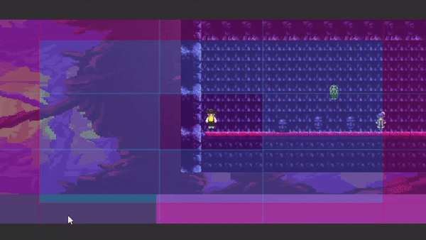

En este repositorio se incluyen todas las prácticas en 2D, menos la de los tilemaps, porque aunque se utilizasen en este proyecto,
no están todos los tipos posibles.
La primera práctica y la segunda, son la de los sprites y las físicas básicas.
En el proyecto hay dos personajes: El jugador y un sprite de morado llamado Modern_guy el cual tiene una animación de dar una vuelta cuando el jugador se aproxime

La siguiente práctica implementada es la de los eventos, en esta se utilizó un botón que al pulsarlo:
- Se cancelaría la animación de dar una vuelta de moder_guy cuando el jugador se acercase
- Una cabeza flotante se pondría al lado del botón (En la posición 3,3)

También se implementó un trigger que cuando el jugador se acercase a la cabeza más cercana, esta misma se pusiese en la posición 3,3

La siguiente práctica es la de Técnicas
En esta está el fondo del mapa normal, el cual utiliza Scroll con movimiento de personaje y a la vez parallax, y justo más abajo del mapa,
está el Scroll con movimiento de fondo.

También se utilizó una pool de objetos para crear diferentes Oola (el sprite verde flotando) en el cual Al pulsar la tecla O, crea una.
Al pulsar la tecla K la destruye, hay como máximo un pool de 10 Oola

La última práctica implementada es la del controlador de cámara, en esta se utiliza la tecla I para la cámara del jugador 1,
la tecla K para la cámara del jugador 2 o Modern_guy y luego la tecla G para la cámara grupal, la cual el jugador 2 tiene mayor prioridad.
Tengo que decir que la parte de los impulse para hacer vibraciones de los objetos no se pudo implementar, como bien sabe, porque la versión
del Cinemachine debería ser una específica y no pudimos encontrar una forma de instalarla en su despacho. 
Como se puede observar en las imágenes de abajo, la cámara del jugador 1 tiene una deadzone menos que la del jugador 2.

Por último, la cámara grupal se fija en los dos jugadores, pero tiene prioridad por el jugador 2

